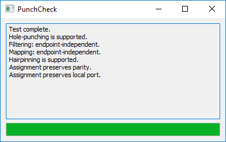

# punch-check 

A simple tool to check whether your router supports UDP hole-punching (for example for use with [autopunch](https://github.com/delthas/autopunch)), as well as additional NAT properties.

If you're not sure what to download, choose **GUI Client**.

| OS | GUI Client | CLI Client | Relay | Server |
| -- | -- | -- | -- | -- |
| Windows | [**Link**](https://delthas.fr/punch-check/windows/punch-check-gui.exe) | [**Link**](https://delthas.fr/punch-check/windows/punch-check.exe) | [**Link**](https://delthas.fr/punch-check/windows/punch-check-relay.exe) | [**Link**](https://delthas.fr/punch-check/windows/punch-check-server.exe) |
| Linux | ✘ | [**Link**](https://delthas.fr/punch-check/linux/punch-check) | [**Link**](https://delthas.fr/punch-check/linux/punch-check-relay) | [**Link**](https://delthas.fr/punch-check/linux/punch-check-server) |
| Mac OS X | ✘ | [**Link**](https://delthas.fr/punch-check/mac/punch-check) | [**Link**](https://delthas.fr/punch-check/mac/punch-check-relay) | [**Link**](https://delthas.fr/punch-check/mac/punch-check-server) |

## Design

[RFC 4787](https://tools.ietf.org/html/rfc4787) defines several NAT properties and which are needed for hole-punching support. Those properties which are checked by this tool are:
- port mapping: either endpoint-independent, address-dependent, or address and port-dependent
- filtering: either endpoint-independent, address-dependent, or address and port-dependent
- hairpinning: supported or unsupported
- port assignment: may be contiguous, preserving, and parity-preserving

For checking these properties, the client would need to connect to at least 2 different IPs, and at least 2 differents ports on an IP. It would also need to create several mappings from several local ports.

The following topology is therefore used:
- a central server sends "packet send" requests to relays and clients, and gathers "packet received" responses from them, then sends the final test results to the client when done
- several relays connect to this central server with a control TCP socket, and open UDP sockets on publicly accessible ports, then wait for requests from the server
- several clients connect to the server with a control TCP socket, open UDP sockets behind their NAT, then wait for requests from the server

The server sends specific "packet send" requests to relays and clients in order to detect all properties of the client NAT as fast as possible with minimal state.

Let C be the client machine; A and B two relays; and let Xi be the i-th port of machine X. The packet send requests are:

From the same local port, send to two different IPs and two differents ports of an IP to check port mapping behaviour.
- C0 -> A0
- C0 -> A1
- C0 -> B0

Try to send packets from two different IPs and two different ports of an IP; one of which is the destination of the client mapping, to check filtering behaviour.
- C1 -> A0
- A0 -> C1
- A1 -> C1
- B0 -> C1

Try to send packets from several local ports to the same IP and port to check port assignment behaviour.
- C2 -> A0
- C3 -> A0
- C4 -> A0

Try to send packets from two local ports to their local NAT ports to check hairpinning behaviour.
- C1 -> C2
- C2 -> C1

All these requests are done simultaneously (provided the needed NAT ports are known). The properties of the NAT are derived from which packets were received and what NAT ports were used for the mappings.

## Acknowledgements

- [RFC4787](https://tools.ietf.org/html/rfc4787)
- [draft-jennings-behave-test-results](https://tools.ietf.org/html/draft-jennings-behave-test-results-01)
- [Peer-to-Peer Communication Across Network Address Translators](https://bford.info/pub/net/p2pnat/)
